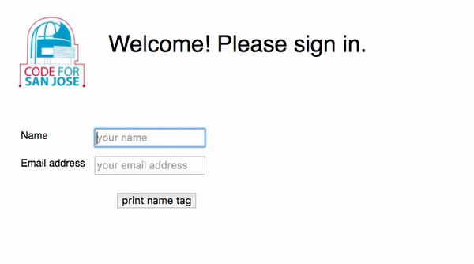

The **Code For San Jose Log-In** system prints out nametags which contain the guests' name and email address as a QR code, name in plain text, and the Code For San Jose Brigade logo.



Pre-requisites
--------------
* Raspberry Pi 2 or 3 running Raspbian in desktop mode.  
* DYMO LabelWriter 450 printer connected to the Raspberry Pi via USB.

The Bill of Materials provides the complete list of equipments, pricing, and links to recommended products.

<details><summary>**Bill of Materials (click to open)**</summary><p>

| Item No. | Description | Quantity | Price | Link |
|----------|---------------|----------|-------|------|
| 1 | Raspberry Pi 3 Model B | 1 | $38.31 | [Amazon link](https://www.amazon.com/Raspberry-Pi-RASPBERRYPI3-MODB-1GB-Model-Motherboard/dp/B01CD5VC92) |
| 2 | Raspberry Pi 7" Touchscreen Display | 1 | $66.99 | [Amazon link](https://www.amazon.com/Raspberry-Pi-7-Touchscreen-Display/dp/B0153R2A9I/) |
| 3 | Power Adapter | 1| $9.99| [Amazon link](https://www.amazon.com/CanaKit-Raspberry-Supply-Adapter-Charger/dp/B00MARDJZ4/) |
| 4 | Keyboard | 1 | $14.99| [Amazon link](https://www.amazon.com/Anker-Bluetooth-Ultra-Slim-Keyboard-Devices/dp/B005ONMDYE/) |
| 5 | Micro SD Card | 1| $15.95| [Amazon link](https://www.amazon.com/Samsung-Class-Micro-Adapter-MB-MC32DA/dp/B00WR4IJBE/) |
| 6 | DYMO LabelWriter 450 | 1| $66.95| [Amazon link](https://www.amazon.com/DYMO-LabelWriter-Thermal-Printer-1752264/dp/B0027JBLV4) |
| 7 | DYMO 2-1/4" x 4" labels (30857) | 1 | $10.00 | [Amazon link](https://www.amazon.com/DYMO-Adhesive-LabelWriter-Printers-30857/dp/B00009WO6F) |

**Total Cost:** $223.18

</p></details>

Setting up your Raspberry Pi as a nametag kiosk
-------------------------------------------------
Setting up your Raspberry Pi as a nametag kiosk involves two steps:
1. [Installing the login system](#installing_login)
2. [Adding the DYMO LabelWriter 450 printer](#adding_printer)

### <a name="installing_login"></a>Installing the login system

1. Open terminal and create a new folder called "GitHub". Run: `mkdir ~/GitHub`
    **NOTE:** Ensure that the folder name is "GitHub" since the folder name is referenced in the install script. 
2. Clone the git repository from GitHub. Run:
    ```
    cd ~/GitHub
    git clone https://github.com/codeforsanjose/CFSJ-Login-System.git
    ```
 
3. Run the install script: `chmod +x ./install/install_deps.sh`

### <a name="adding_printer"></a>Adding the DYMO LabelWriter 450 printer

1. Open Chromium and browse to [http://localhost:631/](http://localhost:631/).
2. Click **Administration** tab at the top and then click **Add Printer** under Printers.
3. In the **Authentication Required** dialog box, enter `pi` as the user name and `raspberry` as the password.
4. Click **Log In**.
5. In the Add Printer page, select **DYMO LabelWriter 450 (DYMO LabelWriter 450)** and then click **Continue**.
6. On the Add Printer page, review the Name and Description. Click **Continue**.
7. Select **DYMO LabelWriter 450** from the Model list.
8. Click **Add Printer**.
9. In the Set Default Options for DYMO_LabelWriter_450 page, set the following:
	* Media size: **30857 Badge Label**
	* Output Resolution: **300x600 DPI**
	* Halftoning: **Error Diffusion**
	* Print Density: **Normal**
	* Print Quality: **Barcodes and Graphics**
10. Click **Set Defaut Options**. You will be redirected to the Printers tab.
11. Click the **Administration** drop-down and select **Set As Server Default**.
12. Finally, close the browser and reboot the device.
After the Raspberry Pi startsup, Chromium should automatically open and display the login system.

